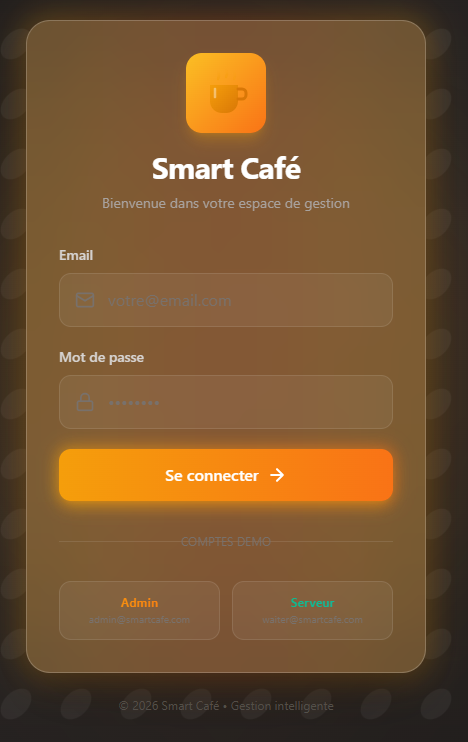
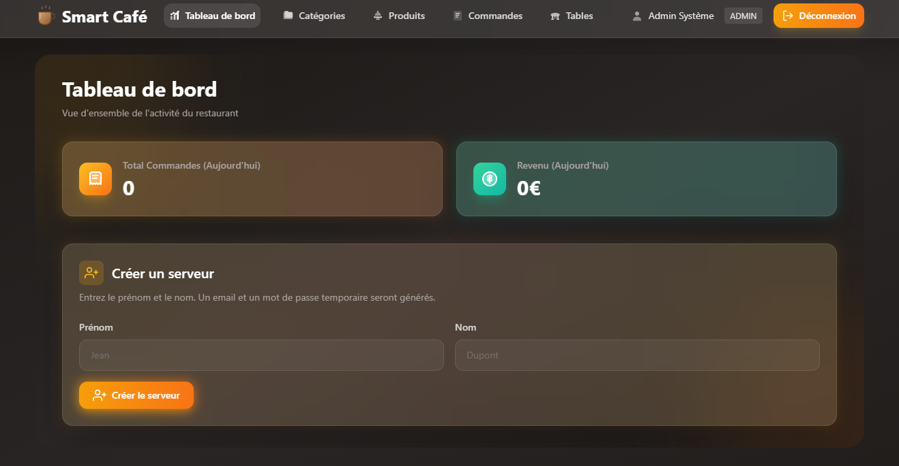
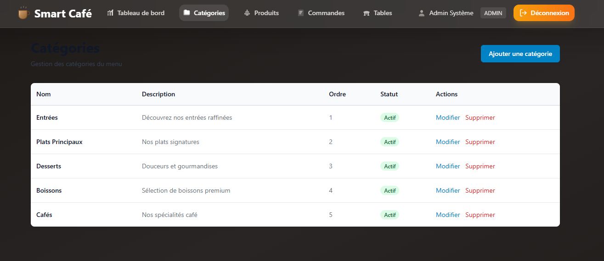
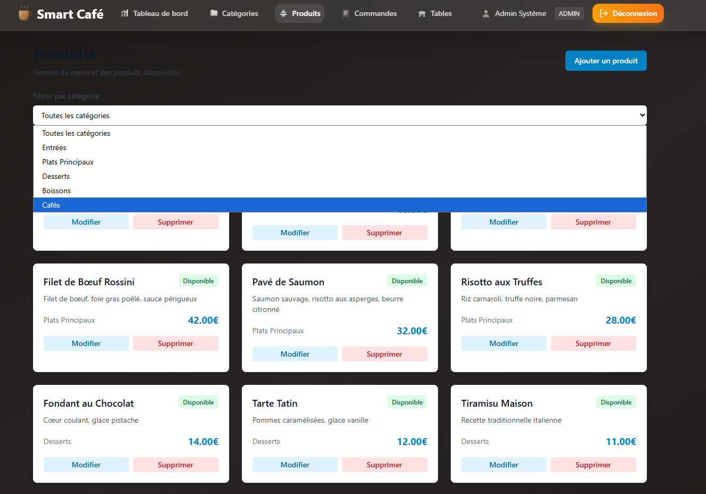
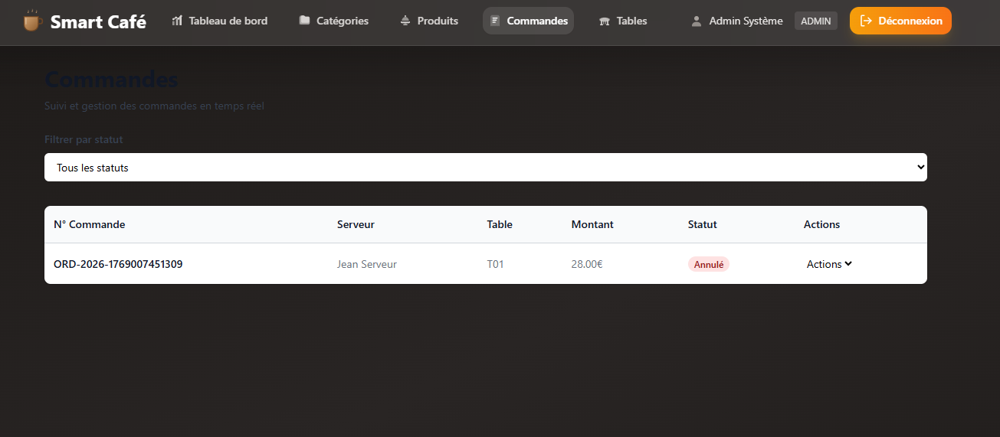
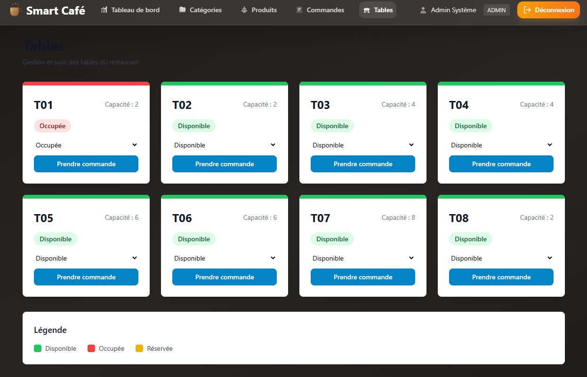
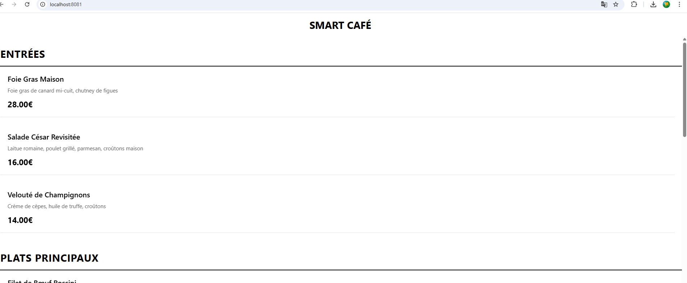

# Documentation Fonctionnelle - Smart Café

## Table des Matières

1. [Vue d'ensemble](#vue-densemble)
2. [Acteurs du système](#acteurs-du-système)
3. [Fonctionnalités](#fonctionnalités)
4. [Parcours utilisateurs](#parcours-utilisateurs)
5. [Règles métier](#règles-métier)
6. [Captures d'écran](#captures-décran)

---

## Vue d'ensemble

Smart Café est une solution complète de gestion de restaurant de luxe. Le système permet aux clients de consulter le menu via une application mobile, tandis que le personnel gère les opérations via une application web.

### Objectifs

- Permettre au client de consulter le menu via QR code (app mobile)
- Centraliser la prise de commande côté serveur (app web)
- Simplifier la gestion des produits, tables et commandes
- Afficher des statistiques simples du jour (total commandes et revenu)

---

## Acteurs du système

### 1. Client

**Rôle** : Utilisateur final qui consulte le menu

**Accès** :
- Application mobile (sans compte)
- Consultation du menu par catégories

### 2. Serveur (WAITER)

**Rôle** : Personnel de service gérant les commandes et tables

**Accès** :
- Application web
- Visualisation des commandes
- Mise à jour du statut des commandes
- Gestion des tables
- Tableau de bord

### 3. Administrateur (ADMIN)

**Rôle** : Gestionnaire ayant tous les droits

**Accès** :
- Toutes les fonctionnalités de WAITER
- Gestion du menu (produits, catégories)
- Création de comptes serveurs
- Statistiques simples du jour

---

## Fonctionnalités

### Authentification

**Description** : Connexion sécurisée avec JWT

**Fonctionnalités** :
- Connexion avec email/mot de passe
- Token JWT avec expiration
- Déconnexion

**Règles** :
- Email unique dans le système

---

### Application Mobile (Client)

#### 1. Consultation du Menu

**Description** : Navigation dans le catalogue de produits

**Fonctionnalités** :
- Affichage des catégories (Entrées, Plats, Desserts, Boissons, Cafés)
- Liste des produits
- Détails produit (nom, description, prix)
- Filtrage par catégorie

**Informations affichées** :
- Nom et description
- Prix en euros

#### 2. Commande (via le serveur)

**Description** : Le client commande oralement, le serveur saisit la commande dans l'application web.

**Fonctionnalités** :
- Le serveur sélectionne la table
- Le serveur clique sur les produits du menu
- La commande est créée et suivie ensuite en cuisine

---

### Application Web (Gestion)

#### 1. Tableau de Bord

**Description** : Vue d'ensemble de l'activité

**Indicateurs affichés** :
- Nombre total de commandes du jour (hors annulées)
- Revenu du jour (commandes READY)

**Rafraîchissement** : Automatique (toutes les 10 secondes)

#### 2. Gestion des Produits

**Description** : CRUD complet sur le menu

**Fonctionnalités** :
- Liste des produits avec filtres
- Création de nouveau produit
- Modification des produits existants
- Suppression de produits
- Activation/désactivation (disponibilité)

**Champs gérés** :
- Nom du produit
- Description
- Prix (€)
- Catégorie
- Temps de préparation (minutes)
- Disponibilité (oui/non)

**Validation** :
- Nom requis
- Prix positif obligatoire
- Catégorie existante requise

#### 3. Gestion des Catégories

**Description** : Organisation du menu

**Fonctionnalités** :
- Liste des catégories
- Création de catégorie
- Modification de catégorie
- Suppression de catégorie
- Ordre d'affichage

**Champs** :
- Nom
- Description
- Ordre d'affichage

**Statut** :
- Actif/Inactif (affichage)

#### 4. Gestion des Commandes

**Description** : Suivi et traitement des commandes

**Fonctionnalités** :
- Liste des commandes
- Filtrage par statut
- Mise à jour du statut

**Informations affichées** :
- Numéro de commande
- Client
- Table
- Total
- Statut actuel

**Actions possibles** :
- Changer le statut : PREPARING, READY, CANCELLED

#### 5. Gestion des Tables

**Description** : État des tables du restaurant

**Fonctionnalités** :
- Vue en grille des tables
- Changement de statut
- Prise de commande depuis une table (menu + panier)

**Statuts** :
- **Disponible** : Table libre
- **Occupée** : Table avec clients
- **Réservée** : Table réservée

**Informations par table** :
- Numéro de table
- Capacité (nombre de places)
- Statut actuel

---

## Parcours utilisateurs

### Parcours Client (État actuel - MVP)

1. **Arrivée au restaurant**
   - Le client s'installe à une table
   - Scan d'un QR code pour ouvrir le menu

2. **Consultation du menu**
   - Navigation par catégories
   - Consultation des produits
   - Lecture des détails (prix, description)

3. **Commande** (via le serveur)
   - Le client fait sa commande oralement au serveur
   - Le serveur crée la commande dans l'application web

4. **Service**
   - Le serveur prépare et sert la commande
   - Le client consomme à table

5. **Fin**
   - Paiement au comptoir (hors application)

### Parcours Serveur

1. **Connexion**
   - Ouverture de l'application web
   - Connexion avec un compte serveur créé par l'admin
   - Accès au dashboard

2. **Prise de commande client**
   - Le client donne sa commande oralement
   - Le serveur crée la commande depuis l'onglet Tables

3. **Suivi des commandes**
   - Visualisation de toutes les commandes en cours
   - Consultation des détails de chaque commande
   - Filtrage par statut

4. **Mise à jour des statuts**
   - Mise à jour : PENDING → "PREPARING" (en cuisine)
   - Mise à jour : PREPARING → "READY" (plat prêt)
   - Mise à jour : READY → "DELIVERED" (servi au client)

5. **Gestion des tables**
   - Consultation de l'état des tables
   - Changement de statut : AVAILABLE ↔ OCCUPIED ↔ RESERVED
   - Libération des tables après service

### Parcours Administrateur

1. **Connexion**
   - Ouverture de l'application web
   - Connexion avec identifiants admin (admin@smartcafe.com)
   - Accès au dashboard

2. **Gestion des catégories**
   - Visualisation de toutes les catégories
   - Création de nouvelles catégories (nom, description, ordre d'affichage)
   - Modification des catégories existantes
   - Suppression de catégories (si aucun produit associé)

3. **Gestion des produits**
   - Consultation de tous les produits par catégorie
   - Création de nouveaux produits (nom, description, prix, temps préparation)
   - Modification des produits existants (prix, description, disponibilité)
   - Suppression de produits
   - Gestion des disponibilités (activer/désactiver)

4. **Gestion des commandes**
   - Visualisation de toutes les commandes
   - Modification des statuts

5. **Gestion des tables**
   - Consultation de toutes les tables
   - Changement de statut des tables

6. **Analyse et statistiques**
   - Dashboard avec mise à jour automatique
   - Total des commandes du jour (hors annulées)
   - Revenu du jour (READY)

---

## Règles métier

### Commandes

1. **Une commande doit contenir au moins un produit**
2. **Le total est calculé automatiquement** (somme des prix × quantités)
3. **Le numéro de commande est unique** (format : ORD-ANNÉE-TIMESTAMP)
4. **Les produits indisponibles ne peuvent être commandés**
5. **Le statut évolue dans cet ordre** : PENDING → PREPARING → READY → DELIVERED (ou CANCELLED)

### Produits

1. **Le prix doit être positif**
2. **Un produit appartient à une seule catégorie**
3. **Un produit indisponible reste en base mais n'apparaît pas au menu**
4. **La suppression d'un produit commandé est restreinte**

### Tables

1. **Le numéro de table doit être unique**
2. **La capacité doit être > 0**
3. **Une table occupée ne peut être supprimée**
4. **Le changement de statut est immédiat**

### Utilisateurs

1. **L'email doit être unique**
2. **Le mot de passe est hashé (bcrypt)**
3. **Un client ne peut accéder qu'à l'app mobile**
4. **Seuls ADMIN et WAITER accèdent à l'app web**
5. **Seul ADMIN peut gérer les produits et catégories**

---

## Captures d'écran

### Page de connexion

### Dashboard (Admin)

### Liste des catégories

### Liste des produits

### Liste des commandes

### Liste des tables

### Mobile — menu

---

## Améliorations futures

### Phase 2 (Court terme)
- Paiement en ligne
- Notifications push
- Système d'avis
- Programme de fidélité
- Confirmation par email

### Phase 3 (Moyen terme)
- Chatbot de recommandation
- Tableau de bord analytique avancé
- Multi-langues
- Personnalisation du thème
- Mode sombre

### Phase 4 (Long terme)
- IA pour prédiction de l'affluence
- Intégration avec systèmes de caisse
- Gestion des stocks
- Interface cuisine dédiée
- Système de réservation

---

## Contraintes techniques rencontrées

### Compatibilité mobile (Expo SDK)

**Problématique** : Incompatibilité entre les versions d'Expo Go et les SDK React Native

**Détails** :
- L'application mobile est développée en React Native avec Expo
- Problèmes de compatibilité rencontrés entre :
  - Expo SDK 49, 52 et 54
  - React Native 0.72, 0.75 et 0.76
  - Expo Go installé sur les appareils physiques
- React Native 0.76+ utilise la nouvelle architecture (TurboModules) qui pose des problèmes de compatibilité

**Impact** :
- L'application mobile fonctionne en version web (navigateur)
- Le déploiement sur appareil physique nécessite des ajustements de versions SDK

**Solution adoptée** :
- Utilisation de l'application mobile en version web (navigateur)
- Le code React Native reste valide et compatible iOS/Android
- Les fonctionnalités sont identiques entre web et mobile
- Pour un déploiement production, utilisation d'Expo EAS Build recommandée

**Justification** :
Dans le délai imparti (4 jours), la priorité a été donnée aux fonctionnalités core (backend, frontend web, sécurité) plutôt qu'à la résolution des problèmes de compatibilité SDK qui sont liés à l'écosystème Expo et non au code développé.

---

## Conclusion

Smart Café représente une solution moderne et complète pour la digitalisation d'un restaurant de luxe. Le système est conçu pour être simple d'utilisation tout en offrant toutes les fonctionnalités nécessaires pour une gestion efficace.

La séparation entre l'application mobile (client) et l'application web (gestion) permet une expérience optimale pour chaque type d'utilisateur.

**Note sur le mobile** : L'application mobile est pleinement fonctionnelle et développée selon les standards React Native. Elle est utilisable en version web et prête pour un déploiement mobile via Expo EAS Build en production.
